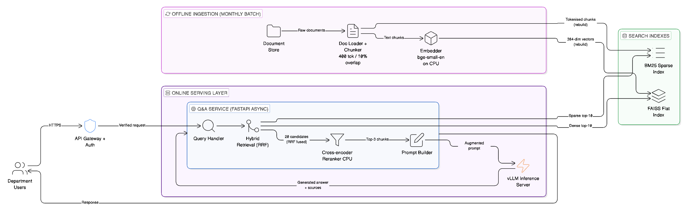

# Part A — LLM-Based Internal Document Q&A System Design

**Author:** Liaw Jian Wei (Jayden)
**Date:** 01 May 2026

---

## Assumptions

These are stated upfront. Where the brief was underspecified, I made a call and documented it here.

| #   | Assumption                                                                                                                                                                  |
| --- | --------------------------------------------------------------------------------------------------------------------------------------------------------------------------- |
| A1  | Deployment is fully air-gapped — no internet or cloud access from the serving layer                                                                                         |
| A2  | GPU cluster assumed to be sufficient for a 13B–70B parameter LLM                                                                                                            |
| A3  | Documents are structured (policy docs, procedures, memos) — answers typically live in discrete, self-contained paragraphs                                                   |
| A4  | Document formats are PDF, DOCX, and/or plain text. No handwritten scans or image-heavy files                                                                                |
| A5  | "Updated monthly" means a batch job runs once a month; documents are not edited in real-time                                                                                |
| A6  | "Snappy" means P95 end-to-end latency under 3 seconds (retrieval ~200 ms, LLM generation ~2 s)                                                                              |
| A7  | ~20 concurrent users is the peak, not the average — design should handle the peak without queuing                                                                           |
| A8  | User authentication and department-level access control are handled upstream by the existing API gateway, not in scope for this assignment                                  |
| A9  | The AI team has Python expertise and can operate FastAPI services, but no dedicated DevOps — operational surface should be minimal                                          |
| A10 | bge-small-en-v1.5 (33M params, 512 token max input) is the selected embedding model; it runs on CPU to keep GPU free for LLM inference                                      |
| A11 | Documents are structured enough that 400-token chunks capture self-contained facts. If documents are flowing legal prose, overlap should be increased in post-deploy tuning |

---

## Architecture Overview

Two planes: an **offline ingestion pipeline** (batch, monthly) and an **online serving stack** (always on).



The offline pipeline converts raw documents into two complementary search indexes. The online stack serves user queries by retrieving from both indexes, reranking the results, and generating a grounded answer via the LLM.

---

## Online Query Flow

Every user query passes through a three-stage retrieval funnel before the LLM is invoked:

```
User Query
    │
    ├─── BM25 Sparse Index ───► top-10 (keyword-ranked)   ─┐
    │    keyword frequency match                             ├─► RRF merge ─► top-20 ─► Cross-Encoder ─► top-3 ─► Prompt Builder ─► vLLM
    └─── FAISS Dense Index ───► top-10 (semantic-ranked)  ─┘
         cosine similarity
```

**Stage 1 — Dual retrieval (parallel):** BM25 and FAISS search independently and simultaneously. BM25 matches exact query tokens against its inverted index. FAISS computes cosine similarity between the query vector and every stored chunk vector. Each returns its own ranked top-10.

**Stage 2 — RRF fusion (normalisation):** Raw scores from BM25 (unbounded, e.g. 32.1) and FAISS (bounded, -1.0 to 1.0) cannot be added directly — BM25 would always dominate. RRF discards raw scores and merges by rank position only, producing a single unified top-20 list. It is the plumbing between the two retrievers and the reranker, not a retrieval step itself.

**Stage 3 — Cross-encoder reranking (deep relevance read):** The cross-encoder is the only component that actually reads the query and each candidate chunk together. It re-scores all 20 candidates and returns the top-3 — correcting any errors RRF introduced from its equal-weight assumption.

The top-3 chunks go to the Prompt Builder, which assembles the grounded prompt sent to vLLM.

---

## Component Breakdown

### 1. Document Store

The source of truth. Holds ~2,000 raw documents in PDF, DOCX, or plain text format. No real-time editing — documents are updated as a batch once per month (assumption A5).

**Why a filesystem and not a document database:** At 2,000 files updated monthly, a database adds operational overhead with no meaningful benefit. A well-organised filesystem with consistent naming conventions (e.g. `HR/2026/circular-07B.pdf`) is fully sufficient. The ingestion pipeline reads files sequentially during the monthly batch — it does not need query, indexing, or transaction semantics.

---

### 2. Doc Loader + Chunker

Extracts raw text from each document and splits it into smaller, overlapping chunks before indexing.

**Why chunking is necessary:** Embedding models and BM25 work best on focused, topic-specific text. A 20-page policy document fed as a single unit would produce a single averaged embedding that represents nothing specifically. Chunking makes retrieval precise.

**Chunk size: 400 tokens / 10% overlap**

- bge-small-en-v1.5 has a hard input cap of 512 tokens. Anything longer is silently truncated. 400 tokens gives safe headroom.
- Smaller chunks improve retrieval precision — the retrieved text is more likely to be directly about the question rather than dragging in surrounding context.
- 10% overlap (40 tokens) ensures that facts sitting at chunk boundaries are not lost — the tail of one chunk appears at the head of the next.
- At ~5 chunks per document, 2,000 documents produce ~10,000 chunks total.

**Alternatives considered and why they were not chosen for v1:**

| Strategy                  | How it works                                                                                                                                  | Why deferred                                                                                                                                                                                |
| ------------------------- | --------------------------------------------------------------------------------------------------------------------------------------------- | ------------------------------------------------------------------------------------------------------------------------------------------------------------------------------------------- |
| **Hierarchical chunking** | Chunk twice — large "parent" blocks and small "child" units. FAISS retrieves child chunks but sends the parent to the LLM for richer context. | More complex ingestion pipeline. Overkill for 2,000 structured docs where chunks are already self-contained (assumption A3). Worth revisiting if answer quality is poor on complex queries. |
| **Semantic chunking**     | Split at natural topic boundaries using an NLP model (e.g. SpaCy) instead of fixed token counts.                                              | Adds a runtime NLP dependency to the ingestion pipeline. The precision gain over sentence-boundary fixed chunking is marginal for structured policy documents.                              |
| **Metadata enrichment**   | Extract `Date_Updated`, `Department`, `Doc_Type` and store alongside each chunk in SQLite. Apply hard pre-filters before FAISS search.        | High value for temporal queries ("what is the 2026 policy?") where dense retrieval would return the semantically identical but outdated version. Recommended as a v2 addition.              |
| **GraphRAG**              | Use a small LLM at ingest time to extract entities and relationships, building a knowledge graph for multi-hop reasoning.                     | Requires a graph database to operate — violates the no-DevOps constraint. Query patterns for doc Q&A do not need multi-hop reasoning at this scale.                                         |

---

### 3. Embedder (bge-small-en-v1.5)

Converts each text chunk into a 384-dimensional dense vector that encodes its semantic meaning. These vectors are what FAISS indexes and searches.

**Why bge-small-en-v1.5:**

- 33M parameters — fast enough to embed 10,000 chunks in a few minutes on CPU.
- Strong retrieval quality for its size. Benchmarks consistently place it above all-MiniLM-L6-v2 at comparable speed.
- Air-gapped compatible — runs fully offline once downloaded.
- 512-token input cap aligns with the 400-token chunk size.

**Why CPU and not GPU:** The GPU is the most constrained and expensive resource in this system. Running the embedder on CPU during the monthly batch keeps the GPU free for LLM inference during the ingestion window. This is **compute isolation** — each heavy resource does one job.

---

### 4. FAISS Flat Index (Dense Index)

Stores the 384-dim vectors produced by the embedder and enables fast similarity search at query time.

**Why FAISS and not a dedicated vector database:**

The three constraints of this assignment — on-premise/air-gapped, no dedicated DevOps, small dataset — make FAISS the right choice.

- **Zero infrastructure overhead:** FAISS is a C++ library with Python bindings (`pip install faiss-cpu`). It runs directly inside the Q&A service's memory space. There is no separate server, no network protocol to configure between microservices, and no external state to manage. ChromaDB or Qdrant would add another background service that can fail independently of the main application.
- **Perfect fit for RAM:** 10,000 chunks × 384 dimensions × 4 bytes = ~15 MB. This fits comfortably in RAM. At this scale, an exact search index (`IndexFlatIP`, inner product / cosine similarity) is used, which guarantees **100% recall** — it checks every vector. There is no need for the approximations (ANN) that large-scale systems (billions of vectors) require, and which dedicated vector databases are built around.
- **Elasticsearch alternative rejected:** Elasticsearch handles both BM25 and dense vectors in one service, which sounds appealing. But it is a heavy Java-based cluster requiring significant operational overhead — exactly what a small team with no DevOps cannot afford.
- **Rebuild frequency:** The index is rebuilt in full once per month alongside the BM25 index. At 10k vectors, a full rebuild takes under 5 minutes. Incremental updates would add complexity with no meaningful benefit at this scale.

---

### 5. BM25 Sparse Index (rank_bm25)

Token-frequency-based sparse retrieval. BM25 scores documents by how often query terms appear in them, adjusted for document length.

**Why BM25 alongside FAISS:** Dense retrieval (FAISS) excels at semantic similarity — it finds chunks that _mean_ the same thing even if different words are used. But it struggles with exact keyword matches: policy codes, acronyms, proper nouns, and specific numbers. BM25 excels at exactly these cases. Together they cover each other's blind spots.

**Example:** A query for "HR Circular 2024-07B" would be handled well by BM25 (exact token match) but poorly by dense retrieval (the circular number has no semantic neighbours). A query for "what is the leave entitlement?" would be handled better by dense retrieval (paraphrase understanding) than BM25.

BM25 is rebuilt alongside FAISS in the same monthly batch job. `rank_bm25` is a pure Python library — no additional services required.

---

### 6. API Gateway + Auth

Entry point for all department user traffic. Terminates HTTPS, validates identity, and forwards verified requests to the Q&A service. Sits outside the Q&A service boundary — the Q&A service trusts all requests that pass through it and performs no re-authentication.

**Why authentication is handled here and not in the Q&A service:** Centralising auth in the gateway keeps the Q&A service stateless — it does not need to maintain session state, token caches, or access control lists. It also means auth logic is maintained once, not duplicated across services. Department-level access control (e.g. which document sets a user can query) is enforced at this layer via the existing internal IAM system (assumption A8).

**Why a dedicated gateway and not direct exposure:** The LLM inference endpoint is a heavy GPU resource. Exposing it directly would allow unauthenticated traffic to trigger expensive GPU computation. The gateway is the single choke point that rejects bad requests before they reach the serving stack.

---

### 7. Hybrid Retrieval + RRF (Reciprocal Rank Fusion)

At query time, both indexes are queried in parallel:

- FAISS returns the **dense top-10** (most semantically similar chunks)
- BM25 returns the **sparse top-10** (most keyword-relevant chunks)

This gives 20 candidates, potentially with overlaps. **Reciprocal Rank Fusion (RRF)** merges the two ranked lists into a single ranked list without requiring any learned weights or training data.

**Why you cannot simply add BM25 and FAISS scores together — the apples vs. oranges problem:**

BM25 scores are unbounded keyword-frequency counts (e.g. 15.4, 32.1). FAISS cosine similarity scores are bounded between -1.0 and 1.0. Adding 32.1 and 0.85 directly would mean BM25 always dominates — the dense signal disappears entirely.

RRF solves this by discarding raw scores from both systems and looking only at **rank position**, sort of a normalization approach. The formula for each candidate:

```
RRF_Score = 1 / (k + Rank_BM25) + 1 / (k + Rank_FAISS)
```

`k = 60` is the standard smoothing constant — it prevents a #1-ranked document in one list from mathematically overpowering everything else. A document ranked #1 by both BM25 and FAISS gets the highest combined score. A document found only by one retriever still gets a partial score. Scale mismatch is irrelevant because only positions are compared.

**Note on `k = 60`:** This value comes from the original RRF paper (Cormack et al., 2009), where it was chosen empirically and has since become a common default. The intuition is that `k` controls how sharply rank position matters: with `k = 0`, rank #1 contributes `1.0`, rank #2 contributes `0.5`, and the top result dominates too aggressively. With `k = 60`, rank #1 contributes `1/61 ≈ 0.0164` and rank #2 contributes `1/62 ≈ 0.0161`, so the top of each list is much flatter. In this design, where each retriever only returns top-10, `k = 60` mainly rewards candidates that appear in both BM25 and FAISS rather than overreacting to whether a candidate was ranked first or second by one retriever.

**Why RRF and not a learned fusion model:** A learned fusion model requires labelled query-document pairs as training data. We do not have that. RRF works out of the box with no calibration.

**Important nuance:** RRF is mathematically blind — it merges rank positions without reading the text. The design uses both: RRF to merge the two lists into a clean top-20, then a cross-encoder to scrutinise that list down to the final top-3.

---

### 8. Cross-Encoder Reranker (ms-marco-MiniLM-L-6-v2)

Takes the 20 RRF-fused candidates and scores each one properly against the user's query, returning the top-3 to the prompt builder.

**Why the reranker exists — "Lost in the Middle":**

Without a reranker, all 20 candidates go into the LLM's context window. LLMs have a well-documented failure mode: if the correct answer is buried in the middle of a long list of documents, the model either misses it or hallucinates. A reranker aggressively filters to the 3 most relevant chunks before the LLM sees anything.

**Why a cross-encoder is better than bi-encoders (FAISS) for this step:**

FAISS uses bi-encoders — the query and the document are encoded _separately_ and compared by dot product. Fast at scale, but the model never "reads" them together.

A cross-encoder (ms-marco-MiniLM-L-6-v2) processes the query and each candidate document _together_ in a single forward pass, using full self-attention across both sequences. It is vastly more accurate at judging true relevance because it actually reads the pair. The tradeoff is speed: you cannot use a cross-encoder to search millions of documents. But scoring 20 candidates takes ~80 ms on CPU, which is entirely acceptable.

**The latency math works in your favour:**

| Step                                 | Cost                                                              |
| ------------------------------------ | ----------------------------------------------------------------- |
| Cross-encoder scores 20 candidates   | ~80 ms (CPU)                                                      |
| LLM processes 3 chunks instead of 20 | Significantly faster Time To First Token (TTFT)                   |
| **Net effect**                       | The 80 ms CPU cost is recovered many times over in GPU time saved |

**Protecting the GPU bottleneck:** By offloading both the embedder (bge-small-en) and the reranker (cross-encoder) to CPU, the GPU is exclusively dedicated to LLM text generation — the only step that actually requires it.

---

### 9. Q&A Service (FastAPI async)

The orchestration layer. Contains three logical sub-components that execute on every query.

**Query Handler** — Receives the verified request from the API gateway and immediately fans out two parallel async calls: one to FAISS (dense retrieval) and one to BM25 (sparse retrieval). Parallelism here is critical — running them sequentially would double retrieval latency for no gain. FastAPI's async model means 20 concurrent users each get their own in-flight query without blocking each other.

**Why FastAPI and not Flask or Django:** Flask is synchronous by default — concurrent requests queue behind each other at the application layer. Django has async support but carries more framework overhead than needed for a single-purpose inference API. FastAPI is async-native, lightweight, and has first-class support for Pydantic request/response validation. It is the right tool for a high-concurrency inference endpoint.

**Prompt Builder** — Receives the top-3 chunks from the cross-encoder and assembles the final prompt sent to vLLM. Structure: system instruction (tells the LLM to answer only from the provided context) + top-3 retrieved chunks with source metadata + the user's original query. Source metadata (filename, chunk index) is retained so the response can include citations. However, top-k can be further evaluated on the best amount through further evaluation.

**Why explicit prompt structure matters:** Without a grounding instruction, the LLM may supplement retrieved context with training-data knowledge — which may be outdated or incorrect for internal policy. The system instruction hard-constrains the model to answer from the provided chunks only, and to say "I don't know" if the answer is not present.

The full request lifecycle:

1. Query Handler receives the user's query
2. BM25 and FAISS run in parallel; each returns top-10
3. RRF fuses the two lists into top-20 candidates
4. Cross-encoder reranker scores all 20; returns top-3
5. Prompt Builder assembles the grounded prompt
6. vLLM generates the answer
7. Response returned with source citations

---

### 10. vLLM Inference Server

Serves the language model with **continuous batching**.

**Why vLLM and not the alternatives:**

| Option                  | Concurrency behaviour                                                            | Verdict                                       |
| ----------------------- | -------------------------------------------------------------------------------- | --------------------------------------------- |
| **vLLM**                | Continuous batching — all 20 requests run in parallel on the same GPU            | ✅ Chosen                                     |
| **Ollama**              | Sequential — one request at a time. Request 20 waits for all 19 others to finish | ❌ Queuing kills "snappy" at peak load        |
| **HuggingFace TGI**     | Production-grade, similar to vLLM. Slightly heavier ops                          | ⚠️ Valid alternative, vLLM has wider adoption |
| **Raw HF Transformers** | No batching infrastructure — queues or OOMs under 20 concurrent users            | ❌ Not suitable                               |

Continuous batching is the key mechanism: instead of waiting for a full batch to finish before starting the next, vLLM slots new requests into GPU computation as soon as existing requests free up token slots. Under 20 concurrent users, this translates to significantly lower P95 latency compared to sequential serving.

---

## Key Decisions and Tradeoffs

### What was chosen and why

| Decision        | Choice                       | Why                                                                                                                                       |
| --------------- | ---------------------------- | ----------------------------------------------------------------------------------------------------------------------------------------- |
| Dense retrieval | FAISS flat index             | 10k vectors is small. Flat index rebuilds in under 5 minutes, zero extra services to operate. No need for ANN approximation at this scale |
| Score fusion    | RRF (Reciprocal Rank Fusion) | Merges BM25 and FAISS rankings without any training data or weight tuning. Works well out of the box                                      |
| Reranker        | Cross-encoder on CPU         | Lifts precision meaningfully before the LLM sees context. Costs ~80 ms — worth it                                                         |
| LLM serving     | vLLM                         | Continuous batching handles 20 concurrent users on one GPU. Without it, request 20 waits for requests 1–19 to finish sequentially         |
| Embedding model | bge-small-en on CPU          | 33M params, fast, air-gapped compatible. Runs on CPU so the GPU stays dedicated to inference                                              |
| Chunk size      | 400 tokens / 10% overlap     | Stays under bge-small-en's 512-token cap. Small enough for precise retrieval; large enough to capture self-contained facts                |

### What was explicitly ruled out

| Rejected option                        | Why                                                                                                                                                             |
| -------------------------------------- | --------------------------------------------------------------------------------------------------------------------------------------------------------------- |
| Fine-tuning the LLM                    | 2,000 documents is not enough signal for fine-tuning to outperform RAG. Fine-tuning also locks knowledge into weights — harder to update than swapping an index |
| Dedicated vector DB (Weaviate, Qdrant) | Adds another service for the team to operate. FAISS in-process handles 10k vectors trivially                                                                    |
| Cloud-hosted embeddings or LLMs        | Air-gapped constraint makes this impossible (assumption A1)                                                                                                     |
| Learned sparse retrieval (SPLADE)      | Requires fine-tuning on domain data we do not have. RRF achieves good fusion without it                                                                         |
| Multi-turn conversation history        | Adds session state and retrieval complexity. Standard doc Q&A is stateless — revisit if users ask for it                                                        |
| GraphRAG                               | Requires a graph database to operate. Violates the no-DevOps constraint. Query patterns at this scale do not need multi-hop reasoning across documents          |
| Streaming responses                    | Adds SSE complexity to the serving layer. Defer to v2 once the core system is stable                                                                            |

---

## Post-Deployment Monitoring

| Signal               | What to track                                                                                    | How                                                            |
| -------------------- | ------------------------------------------------------------------------------------------------ | -------------------------------------------------------------- |
| **Latency**          | P50 and P95 end-to-end; split by retrieval vs LLM generation                                     | Prometheus histograms in FastAPI middleware                    |
| **User feedback**    | Thumbs-up / thumbs-down rate per query                                                           | Simple `/feedback` endpoint; stored in a local Postgres table  |
| **Retrieval recall** | Weekly offline eval — sample 30 queries, check if the correct chunk appears in the top-5 results | Scheduled script against a manually annotated golden JSONL set |
| **LLM error rate**   | 5xx and timeout rate from the vLLM gateway                                                       | Alert if > 2% over any 5-minute window                         |

---

## One Failure Mode That Only Surfaces in Production

**Partial index update produces answers that contradict themselves.**

The monthly batch rebuilds the FAISS index and BM25 index sequentially. If the job is interrupted mid-run (OOM kill, disk full, power cycle), one index finishes and the other does not. The swap into production still happens — or one index is swapped while the other was not yet rebuilt.

At query time, RRF pulls from both. FAISS returns chunks from the new document version; BM25 returns chunks from the old one. Both land in the top-3 context fed to the LLM. The LLM tries to reconcile contradictory policy text and either hedges ("the policy may be...") or picks one version arbitrarily.

**Why it does not appear in testing:** the test environment runs a single batch to completion on a clean dataset. Partial failures only happen in production, under real load and real infrastructure constraints.

**Mitigation:** write new indexes to a staging path, then atomically rename both into the live path together. Keep the previous generation as a fallback. Add a post-batch health check that verifies document counts match between FAISS and BM25 before the swap is committed.
