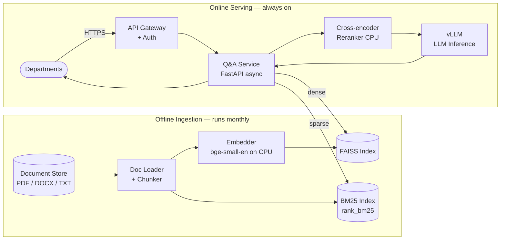

# Part A — LLM-Based Internal Document Q&A System Design

**Author:** Liaw Jian Wei (Jayden)
**Date:** 01 May 2026

---

## Assumptions

These are stated upfront. Where the brief was underspecified, I made a call and documented it here.

| #   | Assumption                                                                                                                                                                  |
| --- | --------------------------------------------------------------------------------------------------------------------------------------------------------------------------- |
| A1  | Deployment is fully air-gapped — no internet or cloud access from the serving layer                                                                                         |
| A2  | GPU cluster assumed to be sufficient for a 13B–70B parameter LLM                                                                                                            |
| A3  | Documents are structured (policy docs, procedures, memos) — answers typically live in discrete, self-contained paragraphs                                                   |
| A4  | Document formats are PDF, DOCX, and/or plain text. No handwritten scans or image-heavy files                                                                                |
| A5  | "Updated monthly" means a batch job runs once a month; documents are not edited in real-time                                                                                |
| A6  | "Snappy" means P95 end-to-end latency under 3 seconds (retrieval ~200 ms, LLM generation ~2 s)                                                                              |
| A7  | ~20 concurrent users is the peak, not the average — design should handle the peak without queuing                                                                           |
| A8  | User authentication and department-level access control are handled upstream by the existing API gateway, not by this service                                               |
| A9  | The team has Python expertise and can operate FastAPI services, but no dedicated DevOps — operational surface should be minimal                                             |
| A10 | bge-small-en-v1.5 (33M params, 512 token max input) is the embedding model. It runs on CPU to keep GPU free for LLM inference                                               |
| A11 | Documents are structured enough that 400-token chunks capture self-contained facts. If documents are flowing legal prose, overlap should be increased in post-deploy tuning |

---

## Architecture Overview

Two planes: an **offline ingestion pipeline** (batch, monthly) and an **online serving stack** (always on).



### What each component does

| Component                   | Responsibility                                                                                                                  |
| --------------------------- | ------------------------------------------------------------------------------------------------------------------------------- |
| **Doc Loader + Chunker**    | Extracts text from PDF/DOCX/TXT. Splits into 400-token chunks with 10% overlap at sentence boundaries (assumption A11)          |
| **Embedder (bge-small-en)** | Encodes each chunk into a 384-dim vector. Runs on CPU — keeps GPU headroom for LLM inference (assumption A10)                   |
| **FAISS Index**             | Flat inner-product index. Rebuilt in full each monthly batch. ~10k vectors (2,000 docs × ~5 chunks avg) fits comfortably in RAM |
| **BM25 Index (rank_bm25)**  | Token-frequency sparse index. Rebuilt alongside FAISS in the same batch job                                                     |
| **Q&A Service (FastAPI)**   | Receives user query, runs hybrid retrieval in parallel, fuses results with RRF, calls reranker, assembles prompt, calls vLLM    |
| **Cross-encoder Reranker**  | Takes top-20 BM25 + FAISS candidates, scores all 20 against the query, returns top-3. Runs on CPU in ~80 ms                     |
| **vLLM**                    | Serves the LLM with continuous batching — handles 20 concurrent users on a single GPU without queuing (assumption A7)           |

---

## Key Decisions and Tradeoffs

### What was chosen and why

| Decision        | Choice                       | Why                                                                                                                                       |
| --------------- | ---------------------------- | ----------------------------------------------------------------------------------------------------------------------------------------- |
| Dense retrieval | FAISS flat index             | 10k vectors is small. Flat index rebuilds in under 5 minutes, zero extra services to operate. No need for ANN approximation at this scale |
| Score fusion    | RRF (Reciprocal Rank Fusion) | Merges BM25 and FAISS rankings without any training data or weight tuning. Works well out of the box                                      |
| Reranker        | Cross-encoder on CPU         | Lifts precision meaningfully before the LLM sees context. Costs ~80 ms — worth it                                                         |
| LLM serving     | vLLM                         | Continuous batching handles 20 concurrent users on one GPU. Without it, request 20 waits for requests 1–19 to finish sequentially         |
| Embedding model | bge-small-en on CPU          | 33M params, fast, air-gapped compatible. Runs on CPU so the GPU stays dedicated to inference                                              |
| Chunk size      | 400 tokens / 10% overlap     | Stays under bge-small-en's 512-token cap. Small enough for precise retrieval; large enough to capture self-contained facts                |

### What was explicitly ruled out

| Rejected option                        | Why                                                                                                                                                             |
| -------------------------------------- | --------------------------------------------------------------------------------------------------------------------------------------------------------------- |
| Fine-tuning the LLM                    | 2,000 documents is not enough signal for fine-tuning to outperform RAG. Fine-tuning also locks knowledge into weights — harder to update than swapping an index |
| Dedicated vector DB (Weaviate, Qdrant) | Adds another service for the team to operate. FAISS in-process handles 10k vectors trivially                                                                    |
| Cloud-hosted embeddings or LLMs        | Air-gapped constraint makes this impossible (assumption A1)                                                                                                     |
| Learned sparse retrieval (SPLADE)      | Requires fine-tuning on domain data we do not have. RRF achieves good fusion without it                                                                         |
| Multi-turn conversation history        | Adds session state and retrieval complexity. Standard doc Q&A is stateless — revisit if users ask for it                                                        |

---

## Post-Deployment Monitoring

| Signal               | What to track                                                                                    | How                                                            |
| -------------------- | ------------------------------------------------------------------------------------------------ | -------------------------------------------------------------- |
| **Latency**          | P50 and P95 end-to-end; split by retrieval vs LLM generation                                     | Prometheus histograms in FastAPI middleware                    |
| **User feedback**    | Thumbs-up / thumbs-down rate per query                                                           | Simple `/feedback` endpoint; stored in a local Postgres table  |
| **Retrieval recall** | Weekly offline eval — sample 30 queries, check if the correct chunk appears in the top-5 results | Scheduled script against a manually annotated golden JSONL set |
| **LLM error rate**   | 5xx and timeout rate from the vLLM gateway                                                       | Alert if > 2% over any 5-minute window                         |

---

## One Failure Mode That Only Surfaces in Production

**Partial index update produces answers that contradict themselves.**

The monthly batch rebuilds the FAISS index and BM25 index sequentially. If the job is interrupted mid-run (OOM kill, disk full, power cycle), one index finishes and the other does not. The swap into production still happens — or one index is swapped while the other was not yet rebuilt.

At query time, RRF pulls from both. FAISS returns chunks from the new document version; BM25 returns chunks from the old one. Both land in the top-3 context fed to the LLM. The LLM tries to reconcile contradictory policy text and either hedges ("the policy may be...") or picks one version arbitrarily.

**Why it does not appear in testing:** the test environment runs a single batch to completion on a clean dataset. Partial failures only happen in production, under real load and real infrastructure constraints.

**Mitigation:** write new indexes to a staging path, then atomically rename both into the live path together. Keep the previous generation as a fallback. Add a post-batch health check that verifies document counts match between FAISS and BM25 before the swap is committed.

---

## Eraser.io Architecture Diagram

Paste the block below into [https://app.eraser.io](https://app.eraser.io) → New diagram → Cloud Architecture.

```
title LLM Document Q&A — On-Premises Architecture

direction right

Departments [label: "Department Users", icon: users]

API Gateway [label: "API Gateway + Auth", icon: shield, color: blue]

Online Serving [label: "Online Serving Layer", icon: server, color: indigo] {
  QA Service [label: "Q&A Service (FastAPI async)", icon: cpu] {
    Query Handler [label: "Query Handler", icon: search]
    Hybrid Retrieval [label: "Hybrid Retrieval (RRF)", icon: git-merge]
    Reranker [label: "Cross-encoder Reranker CPU", icon: filter]
    Prompt Builder [label: "Prompt Builder", icon: edit]
  }
  vLLM [label: "vLLM Inference Server", icon: zap, color: orange]
}

Indexes [label: "Search Indexes", icon: database, color: green] {
  FAISS [label: "FAISS Flat Index", icon: layers]
  BM25 [label: "BM25 Sparse Index", icon: list]
}

Offline Pipeline [label: "Offline Ingestion (monthly batch)", icon: refresh-cw, color: purple] {
  Doc Store [label: "Document Store", icon: folder]
  Doc Loader [label: "Doc Loader + Chunker\n400 tok / 10% overlap", icon: file-text]
  Embedder [label: "Embedder\nbge-small-en on CPU", icon: box]
}

// --- Online flow ---
Departments > API Gateway: HTTPS
API Gateway > Query Handler: Verified request
Query Handler > Hybrid Retrieval
Hybrid Retrieval > FAISS: Dense top-10
Hybrid Retrieval > BM25: Sparse top-10
Hybrid Retrieval > Reranker: 20 candidates (RRF fused)
Reranker > Prompt Builder: Top-3 chunks
Prompt Builder > vLLM: Augmented prompt
vLLM > QA Service: Generated answer + sources
QA Service > Departments: Response

// --- Offline flow ---
Doc Store > Doc Loader: Raw documents
Doc Loader > Embedder: Text chunks
Embedder > FAISS: 384-dim vectors (rebuild)
Doc Loader > BM25: Tokenised chunks (rebuild)
```
